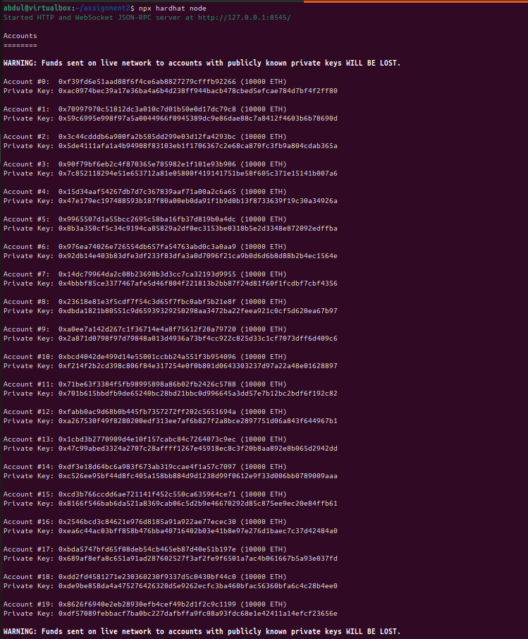
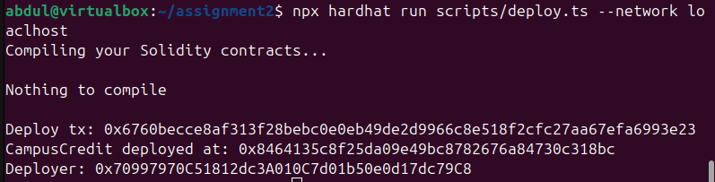
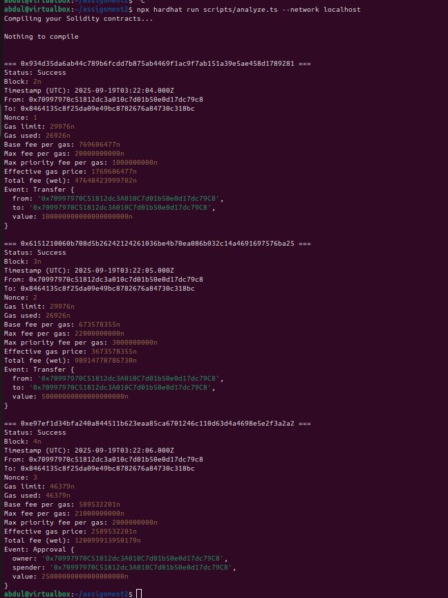
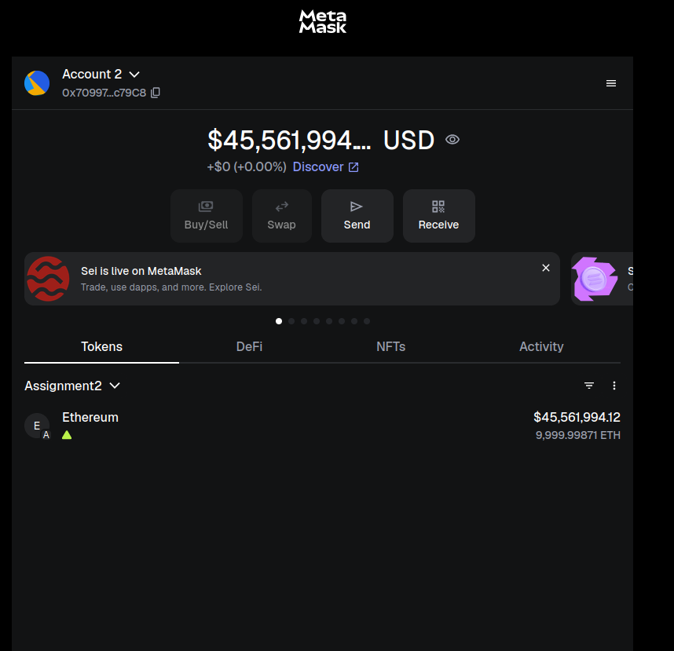

# Blockchain Assignment 2 - Analyze Transactions with Hardhat

## 📋 Project Overview
This project demonstrates the deployment and interaction with an ERC-20 token called **CampusCredit (CAMP)** on a local Hardhat blockchain network. The assignment involves deploying the token, executing transactions with different gas fees, and analyzing transaction details.

## 🛠️ Technical Stack
- **Hardhat v3**: Ethereum development environment  
- **Solidity 0.8.24**: Smart contract programming language  
- **Viem**: TypeScript interface for Ethereum  
- **OpenZeppelin Contracts**: ERC-20 implementation  
- **MetaMask**: Web3 wallet for interaction  

## 📁 Project Structure
blockchain-assignment2/
├── contracts/
│ └── CampusCredit.sol # ERC-20 token contract
├── scripts/
│ ├── deploy.ts # Deployment script
│ ├── interact.ts # Transaction execution script
│ └── analyze.ts # Transaction analysis script
├── hardhat.config.ts # Hardhat configuration
├── .env # Environment variables (gitignored)
├── .gitignore # Git ignore rules
├── package.json # Dependencies and scripts
├── tsconfig.json # TypeScript configuration
├── report.md # Assignment report + screenshots
└── screenshots/ # Terminal outputs and MetaMask screenshots


## ⚙️ Setup Instructions

### 1. Prerequisites
- Node.js v22.x LTS  
- MetaMask browser extension  

### 2. Installation
```bash
# Initialize project
npm init -y

# Install dependencies
npm install --save-dev hardhat @nomicfoundation/hardhat-viem @openzeppelin/contracts dotenv

# Initialize Hardhat
npx hardhat init
# Choose: hardhat-3
# Template: node-test-runner-viem
# Accept ESM when prompted

# Create an .evn file 
RPC_URL = "YOUR_URL"
CHAIN_ID = "ID"
PRIVATE_KEY = "GENERATED BY RUNNING npx hardhat node "

### 1. Prerequisites









