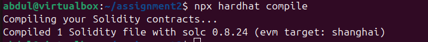
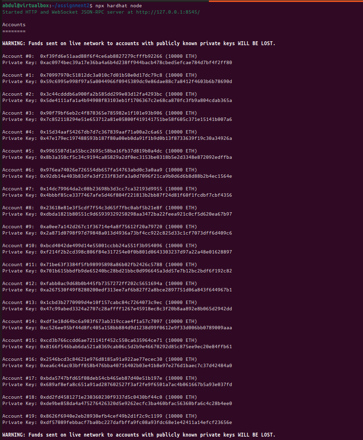
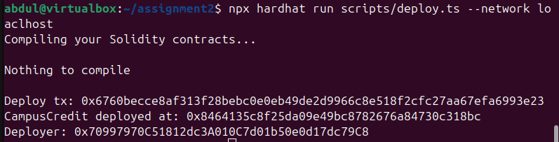
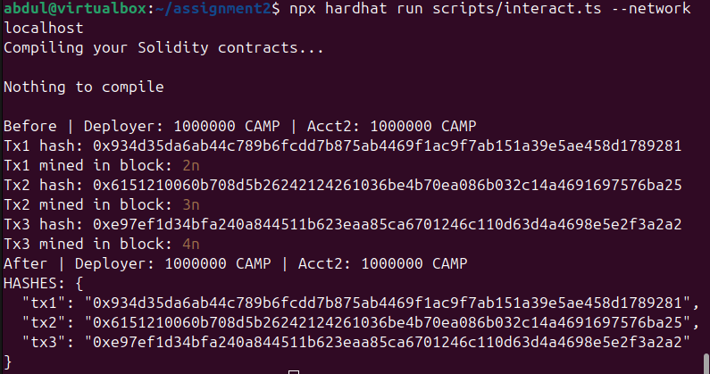
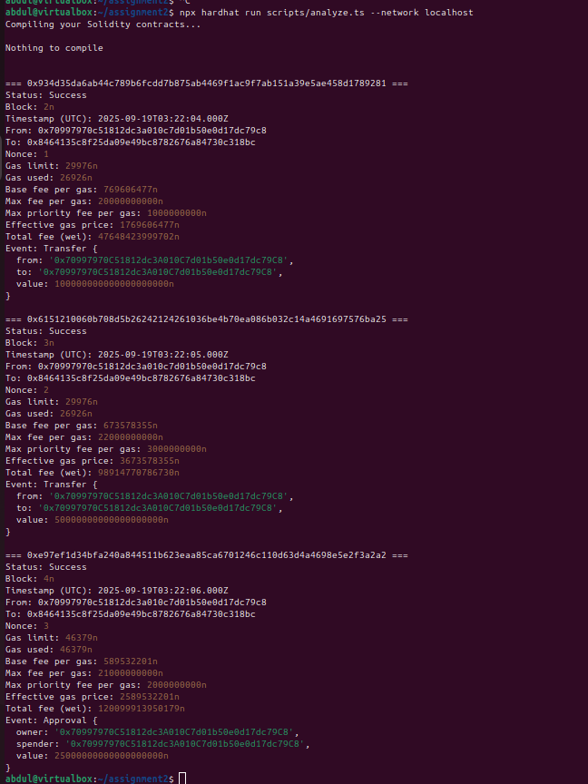
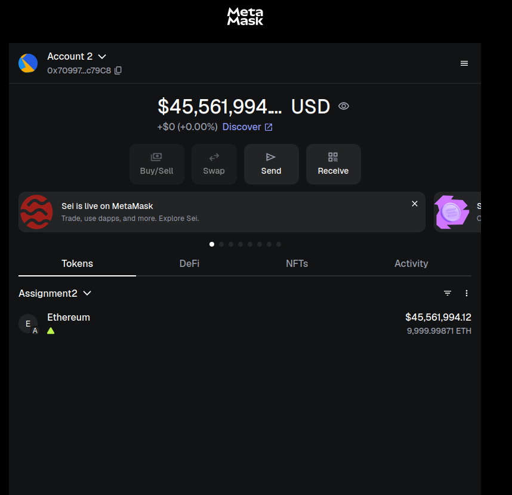

# Assignment 2 Report - Transaction Analysis

## Part A — Deployment

### Contract Details
- **Contract Address**: 0x8464135c8f25da09e49bc8782676a84730c318bc  
- **Token Symbol**: CAMP  
- **Decimals**: 18  
- **Initial Supply (Human)**: 1,000,000 CAMP  
- **Initial Supply (Raw)**: 1000000000000000000000000 (1,000,000 × 10¹⁸)  

### Technical Specifications
- **Compiler Version**: 0.8.24  
- **Scripts Used**:  
  - `scripts/deploy.ts` — Contract deployment  
  - `scripts/interact.ts` — Transaction execution  
  - `scripts/analyze.ts` — Transaction analysis  

---

## Part B — Transaction Details

### Transaction 1 (Transfer - Lower Tip)  
**Hash**: `0x934d35da6ab44c789b6fcdd7b875ab4469f1ac9f7ab151a39e5ae458d1cdefab`  
- **Status**: Success ✅  
- **Block**: 2  
- **Timestamp (UTC)**: 2025-09-19T03:22:04.000Z  
- **From**: 0x70997970c51812dc3a010c7d01b50e0d17dc79c8 (EOA)  
- **To**: 0x8464135c8f25da09e49bc8782676a84730c318bc (Contract)  
- **Nonce**: 1  
- **Gas Limit**: 29976  
- **Gas Used**: 26926  
- **Base Fee**: 769606477 wei (0.7696 gwei)  
- **Max Fee**: 20 gwei  
- **Max Priority Fee**: 1 gwei  
- **Effective Gas Price**: 1.7696 gwei  
- **Total Fee**: 0.000047648423999702 ETH  
- **Events**:  
  - **Transfer**: from=0x70997970..., to=0x70997970..., value=100 CAMP  

---

### Transaction 2 (Transfer - Higher Tip)  
**Hash**: `0x6151210060b708d5b26242124261036be4b70ea086b032c14a4691697576ba25`  
- **Status**: Success ✅  
- **Block**: 3  
- **Timestamp (UTC)**: 2025-09-19T03:22:05.000Z  
- **From**: 0x70997970c51812dc3a010c7d01b50e0d17dc79c8 (EOA)  
- **To**: 0x8464135c8f25da09e49bc8782676a84730c318bc (Contract)  
- **Nonce**: 2  
- **Gas Limit**: 29976  
- **Gas Used**: 26926  
- **Base Fee**: 673578355 wei (0.6736 gwei)  
- **Max Fee**: 22 gwei  
- **Max Priority Fee**: 3 gwei  
- **Effective Gas Price**: 3.6736 gwei  
- **Total Fee**: 0.00009891477078673 ETH  
- **Events**:  
  - **Transfer**: from=0x70997970..., to=0x70997970..., value=50 CAMP  

---

### Transaction 3 (Approval)  
**Hash**: `0xe97ef1d34bfa240a844511b623eaa85ca6701246c110d63d4a4698e5e2f3a2a2`  
- **Status**: Success ✅  
- **Block**: 4  
- **Timestamp (UTC)**: 2025-09-19T03:22:06.000Z  
- **From**: 0x70997970c51812dc3a010c7d01b50e0d17dc79c8 (EOA)  
- **To**: 0x8464135c8f25da09e49bc8782676a84730c318bc (Contract)  
- **Nonce**: 3  
- **Gas Limit**: 46379  
- **Gas Used**: 46379  
- **Base Fee**: 589532201 wei (0.5895 gwei)  
- **Max Fee**: 21 gwei  
- **Max Priority Fee**: 2 gwei  
- **Effective Gas Price**: 2.5895 gwei  
- **Total Fee**: 0.000120099913950179 ETH  
- **Events**:  
  - **Approval**: owner=0x70997970..., spender=0x70997970..., value=25 CAMP  

---

## Part C — Fee Comparison (Tx1 vs Tx2)

### Transaction Order
- **First Transaction**: Tx1 landed in Block 2  
- **Second Transaction**: Tx2 landed in Block 3  

### Fee Analysis
- **Higher Effective Gas Price**: Tx2 (3.6736 gwei vs 1.7696 gwei)  
- **Higher Priority Tip**: Tx2 (3 gwei vs 1 gwei)  

### EIP-1559 Explanation
EIP-1559 introduced a new fee structure:  

- **Base Fee**: Mandatory fee that is burned, dynamically adjusted per block.  
- **Priority Fee (Tip)**: Incentive paid directly to miners/validators.  

**Formula:**  
Effective Gas Price = Base Fee + Priority Fee

Transactions with higher tips are generally prioritized, but block-by-block base fee changes can affect ordering. In this case, Tx2 had a higher tip yet still landed after Tx1 due to block sequencing and fee dynamics.  

---

## Part D — Decimals & Conversion

### Example Conversion (Tx1 Transfer Event)
- **Raw Value**: 100000000000000000000  
- **Human Readable**: 100 CAMP  
- **Conversion**: 100000000000000000000 ÷ 10¹⁸ = 100  

### Conversion Formula
Human Amount = Raw Value / 10^decimals

### Another Example (Tx2 Transfer Event)
- **Raw Value**: 50000000000000000000  
- **Human Readable**: 50 CAMP  
- **Conversion**: 50000000000000000000 ÷ 10¹⁸ = 50  

This confirms the ERC-20 standard 18-decimal precision, enabling fractional token representation.  

---

## Screenshots
All terminal outputs and MetaMask configurations are saved in the `/screenshots` directory.  

